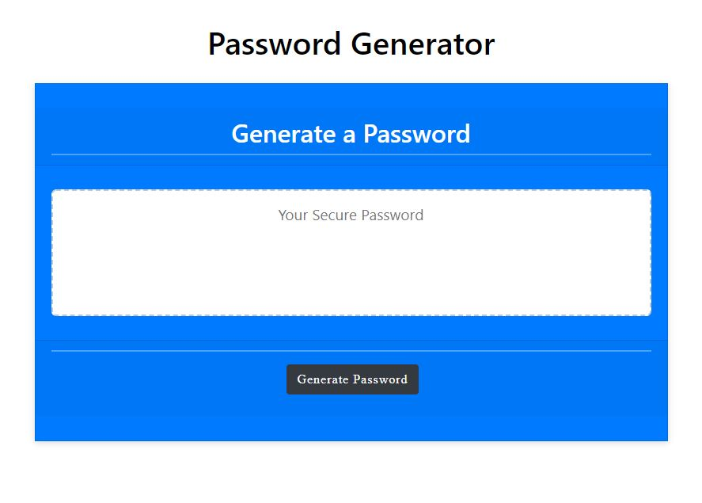

# 03 JavaScript: Password Generator

* WHEN I click the button to generate a password, application starts to work

* Then User asked for the length of the password, if user enters a non numaric character, User will promted to enter the number until the user enters a numeric value.

* Then password lenght will be checked , if the given length number is not between 8 - 128 user will be promted to enter the right number until the user enters a numeric value between 8 -128 .

* WHEN prompted for character types to include in the password

* THEN I choose lowercase, uppercase, numeric, and special characters

* WHEN I answer each prompt

* THEN my answers will be checked and at least one character type should be selected if not, User will be prompted to select the password options, till the user select at least one option. 

* WHEN all prompts are answered 

* THEN a password is generated that matches the selected criteria 

* WHEN the password is generated 

* THEN the password is written to the page

* Github Repository :  https://github.com/kinziva/HKPasswordGenerateJS

* URL of the deployed application : https://kinziva.github.io/HKPasswordGenerateJS/

 
